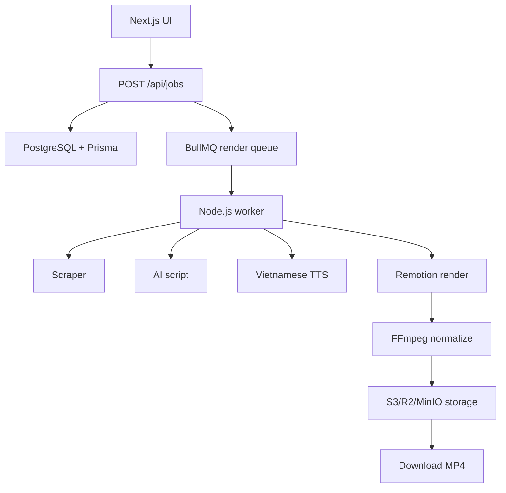

# Architecture

## Job State

`queued`, `scraping`, `scripting`, `tts`, `rendering`, `uploading`, `completed`, `failed`.

Jobs use BullMQ `jobId = RenderJob.id` so retries do not create duplicate queue entries. Credit hold is created in the same DB transaction as the job.

Render service now builds a deterministic Remotion plan and FFmpeg normalize args. Real media execution stays behind that service.

AI script service tries Gemini, then DeepSeek, then OpenAI. Missing keys fall back to deterministic Vietnamese drafts.

TTS service tries FPT.AI, then Viettel, then Zalo, then OpenAI-compatible fallback. Missing keys fall back to placeholder voice assets.

Bank billing uses unique payment codes, token-protected poll endpoint, transaction matching, and credit ledger grant in one DB transaction.

Admin stats endpoint aggregates users, jobs, videos, paid payments, revenue, and credits sold behind admin role guard.

## Deliberate MVP Limits

- No auto-post.
- No real billing webhook until product flow works.
- No scraper bypass for private/internal URLs.
- No Python core service.
