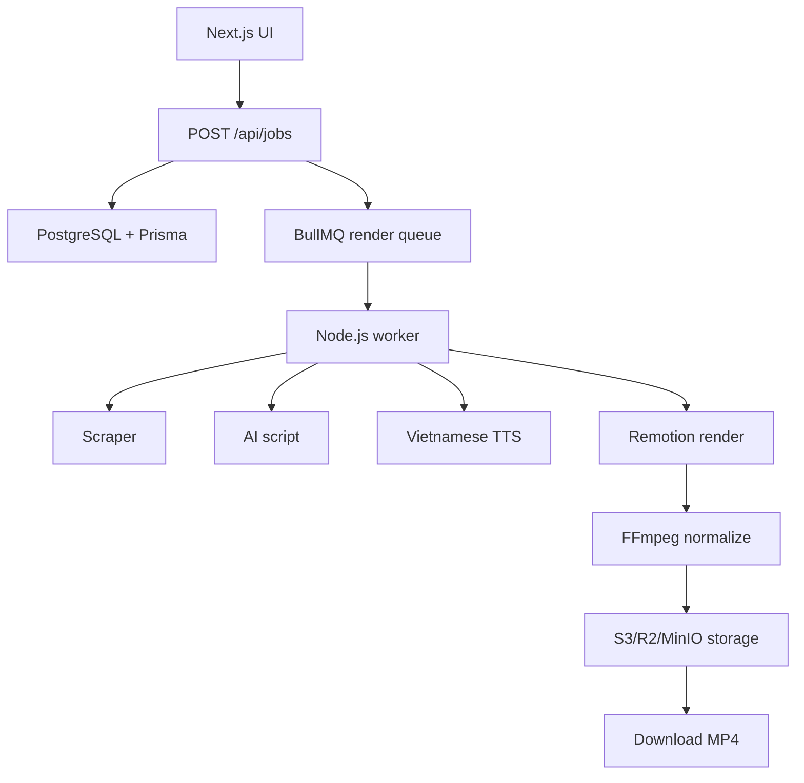

# Architecture

## Job State

`queued`, `scraping`, `scripting`, `tts`, `rendering`, `uploading`, `completed`, `failed`.

Jobs use BullMQ `jobId = RenderJob.id` so retries do not create duplicate queue entries. Credit hold is created in the same DB transaction as the job.

Render service now builds a deterministic Remotion plan and FFmpeg normalize args. Real media execution stays behind that service.

AI script service tries Gemini, then DeepSeek, then OpenAI. Missing keys fall back to deterministic Vietnamese drafts.

TTS service tries FPT.AI, then Viettel, then Zalo, then OpenAI-compatible fallback. Missing keys fall back to placeholder voice assets.

Bank billing uses unique payment codes, token-protected poll endpoint, transaction matching, and credit ledger grant in one DB transaction.
User billing payment API creates pending bank-transfer payments with amount, credits, unique code, bank instruction, and QR payload text.

Admin stats endpoint aggregates users, jobs, videos, paid payments, revenue, and credits sold behind admin role guard.

Admin job API lists jobs by status and can requeue failed jobs with audit logging.

Admin payment API lists payments and supports manual confirmation with credit ledger grant plus audit log.
Admin payment refund API marks payments refunded and reverses credits for previously paid bank payments.

Middleware resolves tenant domain from host and exposes tenant headers for future multi-domain branding.

Schema includes admin-managed VideoTemplate, TTSProvider, AIProvider, and SystemSetting models.

Video library API filters user videos by render status, source host, series, template, language, and date range. It returns signed download URLs.
Job preview API lets the owner view and edit product title, price, images, selected script, script body, CTA, voice, music track, music volume, and caption preset before render/post reuse.

Schedule API stores per-platform planned posts with caption, hashtags, scheduled time, and manual publish checklist for platforms without approved posting APIs. Schedule suggestion API creates platform-specific title, caption, hashtags, CTA, and affiliate disclosure from video product/script metadata.
Dashboard schedule calendar shows manual publish checklist steps for API-limited platforms.
Best-time API returns platform-specific posting time recommendations using local timezone offsets and rule-based defaults.

TikTok calculator estimates engagement, post value range, and affiliate potential from user-supplied metrics.

Referral API creates stable referral links and stores pending/paid affiliate commissions for the SaaS affiliate program.

Caption export API converts caption segments to SRT or VTT for Caption Studio and downloadable metadata assets. Caption preview API returns preset styles and emphasized words for clean bold, deal pop, story subtle, and karaoke highlight modes.

Video export bundle API returns MP4 signed URL, product metadata, source URL, series metadata, scripts, and generated SRT/VTT captions.
Series API creates content series and lets owners pause/resume automation state.
Series next-run API calculates cadence interval, next run time, and credit-blocked state for automation planning.
Thumbnail API returns a 1080x1920 thumbnail render plan from video product title, price, image, and accent metadata.
Audio ducking API returns FFmpeg sidechain compression plans for soft, normal, and aggressive background-music ducking.
Media preview API lists default Vietnamese voice previews and copyright-safe background music presets before render.
Pipeline readiness check verifies scraper, three scripts, voice, render plan, and storage key before integration tests.

Admin settings API reads by group and upserts validated setting values with audit logging.

Admin template API can list, create, update, and disable video templates with audit logging.

Template marketplace API exposes active template previews with category, platform, tag, plan, thumbnail, and sample output filters from admin-managed template config.

Inspiration board API lets users save public competitor examples with platform, hook, CTA, template key, notes, and tags for later script/template planning.

Clip candidate API scores pasted long-video transcripts and returns short-form candidate hooks, start/end hints, estimated duration, and next action.

Notification service creates in-app notifications and email delivery records for render-complete, render-failed, payment-confirmed, welcome, and password-reset events. If `EMAIL_WEBHOOK_URL` is configured, it posts transactional email payloads through that provider endpoint.
Notification API lists recent in-app notifications, updates user preferences, and marks owned notifications as read.
Notification preferences suppress non-security email during quiet hours or digest mode while still allowing password reset and admin test messages.
Digest service stores deferred/digest-pending email records and can send one summary email per user, then marks included records as digested.
Admin email delivery API lists transactional email audit records by status, event, user, and date order. Failed or skipped deliveries can be retried by an admin endpoint.
Email provider webhook updates delivery audit status by provider ID or delivery ID using `EMAIL_EVENT_WEBHOOK_SECRET`.
Admin email template API lists default/custom transactional templates, saves overrides in `SystemSetting`, and sends test emails through the same delivery log.
Admin stale-job alert API scans queued render jobs older than a threshold and sends one queued-too-long notification per job.
Admin stats includes email delivery totals, failed deliveries, and pending/deferred/digest-pending counts for notification health.

## Deliberate MVP Limits

- No auto-post.
- No real billing webhook until product flow works.
- No scraper bypass for private/internal URLs.
- No Python core service.
