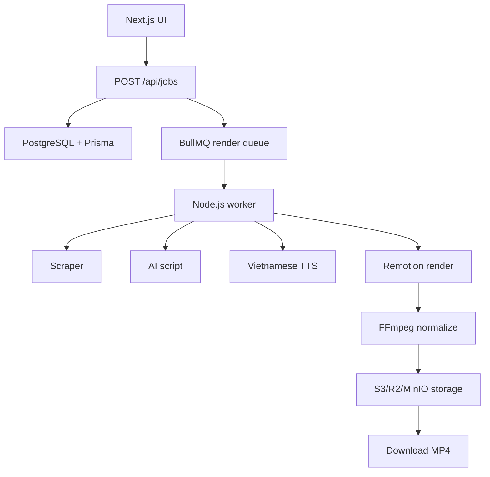

# Architecture

## Job State

`queued`, `scraping`, `scripting`, `tts`, `rendering`, `uploading`, `completed`, `failed`.

Jobs use BullMQ `jobId = RenderJob.id` so retries do not create duplicate queue entries. Credit hold is created in the same DB transaction as the job.

Render service now builds a deterministic Remotion plan and FFmpeg normalize args. Real media execution stays behind that service.

## Deliberate MVP Limits

- No auto-post.
- No real billing webhook until product flow works.
- No scraper bypass for private/internal URLs.
- No Python core service.
